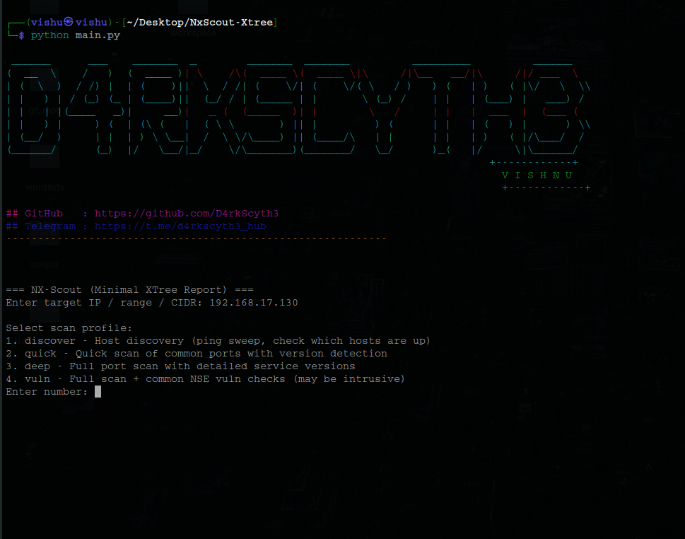

# NX-Scout XTree


NX-Scout XTree is a lightweight __Nmap automation tool__ written in Python.  

It helps security professionals and learners quickly perform host discovery, port scanning, and vulnerability checks with a clean __tree-style tabular report__.


---


## Features

#### Multiple Scan Profiles :-

* **Discover** -> *Host discovery (ping sweep, checks which hosts are up)*  

* **Quick** -> *Fast scan of common ports with service version detection*  

* **Deep** -> *Full port scan with detailed service versions* 

* **Vuln** -> *Full scan + common NSE vulnerability scripts*  
  
#### Clean Reports :-

* *Minimal tree-style console view*

* *Optional HTML/JSON/XML export*

#### Details per host :- 

- *IP Address*  

- *MAC Address \& Vendor*  

- *Host state (up/down)*  

- *Open Ports + Services + Versions*  

- *Vulnerability findings (if applicable)*  


#### Flexible Target Input :-

- *Single IP → `192.168.17.10`*  

- *Range → `192.168.17.1-50`*  

- *Subnet (CIDR) → `192.168.17.0/24`*  


---


## Installation


#### Requirements :-

\~ In Windows:

\[Python 3.8+] (https://www.python.org/downloads/) -> *installed \& added to PATH*

\[Nmap] (https://nmap.org/download) -> *installed \& added to PATH*

<br><br>
\~ In Linux:

**Python**
```
sudo apt update & sudo apt upgrade -y
```
```
sudo apt install python3 -y
sudo apt install python3-pip -y
```
**Nmap**
```
sudo apt install nmap -y
```
### Uses

\# *Clone the repo ->*  
```
git clone https://github.com/D4rkScyth3/NxScout-Xtree.git
cd NxScout-Xtree
```

\# *Simply run ->*
```
python main.py
```




